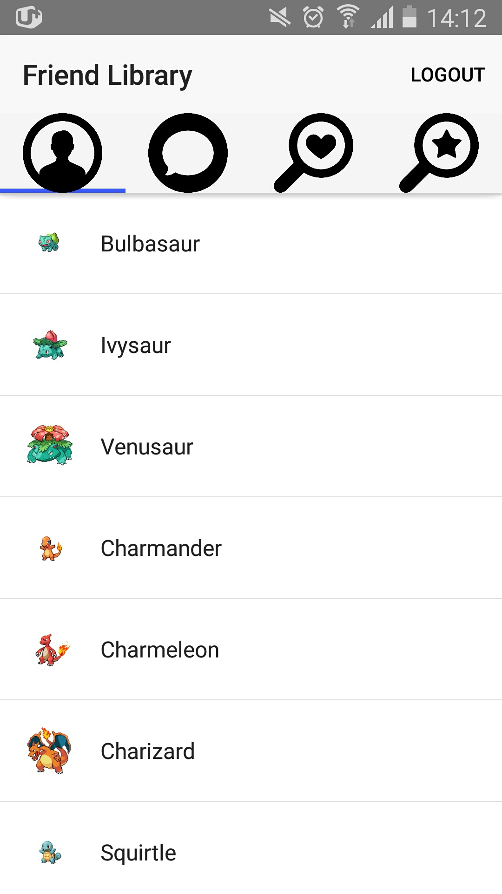
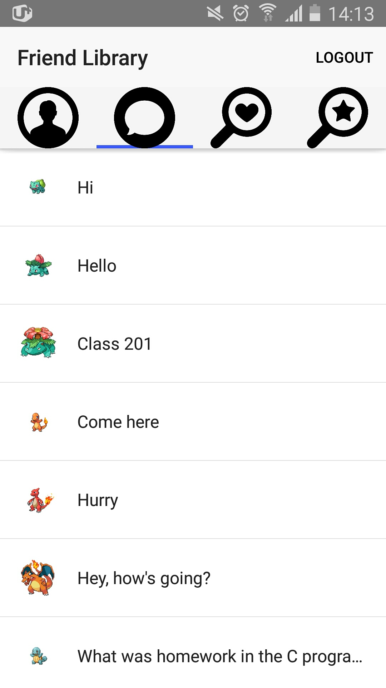
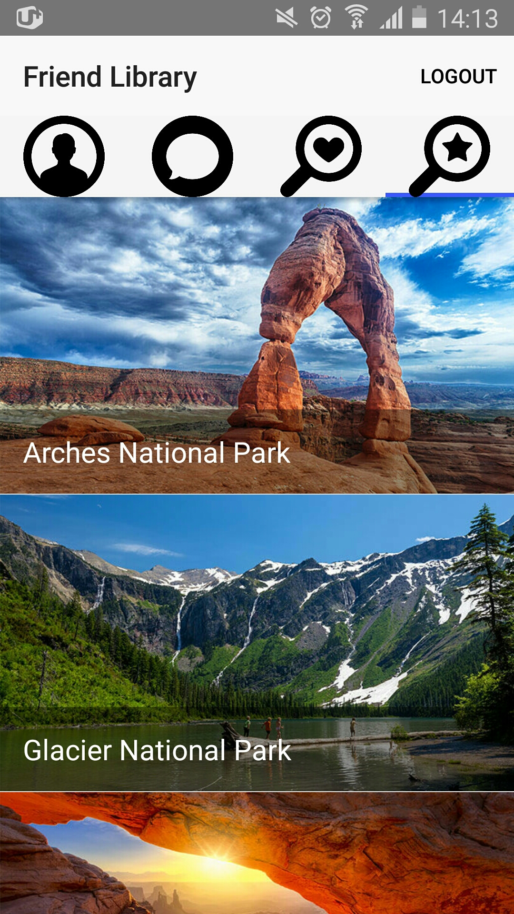

Chat Service for Gathering Data
==========================================================
We can give some recommendation to users with enneagram. 
User can make friends easy with this app. 
We can get some data from user. This data will be used for data analyzing.

For User win
------------
Good Service for young people. 

For Our win
------------
Good Serveying from user. 
You shouldn't let them know that they are getting surveyed.

Developement Steps.
--------------
1. Select The dev platform [done] 
2. Make a login app with database [done] 

3. Design simple function and make a simple UI [done] 

Home UI

4. Design complex function and make a complex UI 

Unlock Friend ChatUI

5. Link and test simple-data function to database. 
6. Link and test multi-interation function to database. 
7. Design OOP model and database. 
8. Build an IOS/android App. 
9. Alpha test and bug report. 
10. Redesign with fancy UI. 
11. Refactoring. 
12. Beta test and bug report. 

myApp(Back-End Development)
-----
This is fo testing database. I have tested firebase database with this.

NSPlayground(Front-End Development)
------------
This is for UI test in the application. 
If you want to make some UI for mobile application, it will be good choice using NSPlayground.

Contact
--------
name : SanSoo Han 
email : sansoo2002@naver.com 
phone : +82 10-8835-9229
