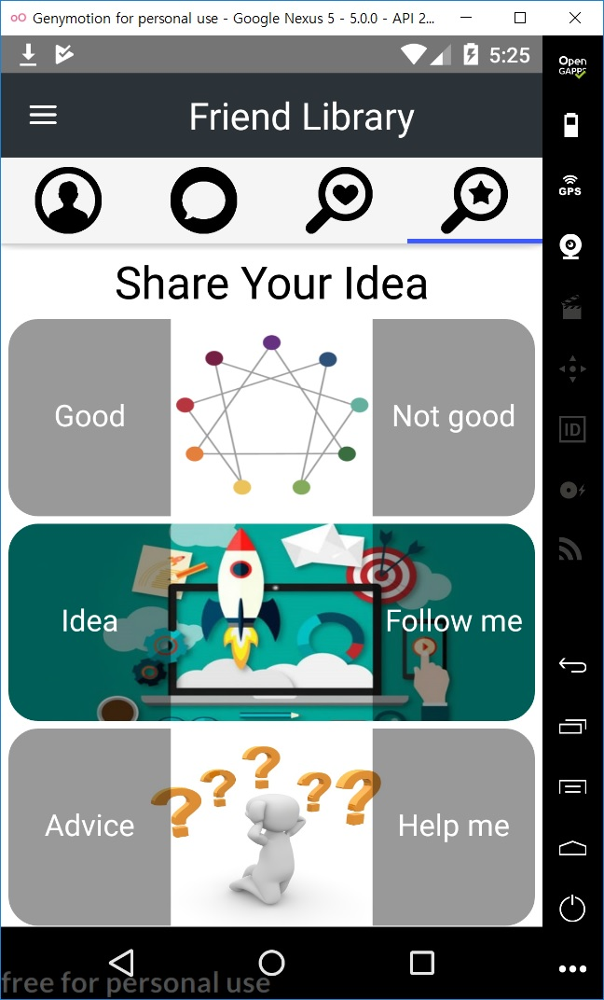
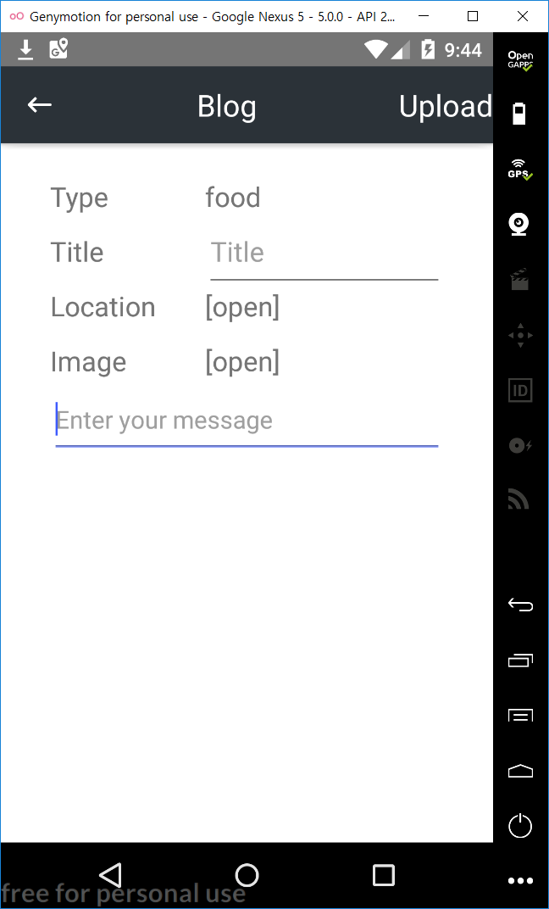
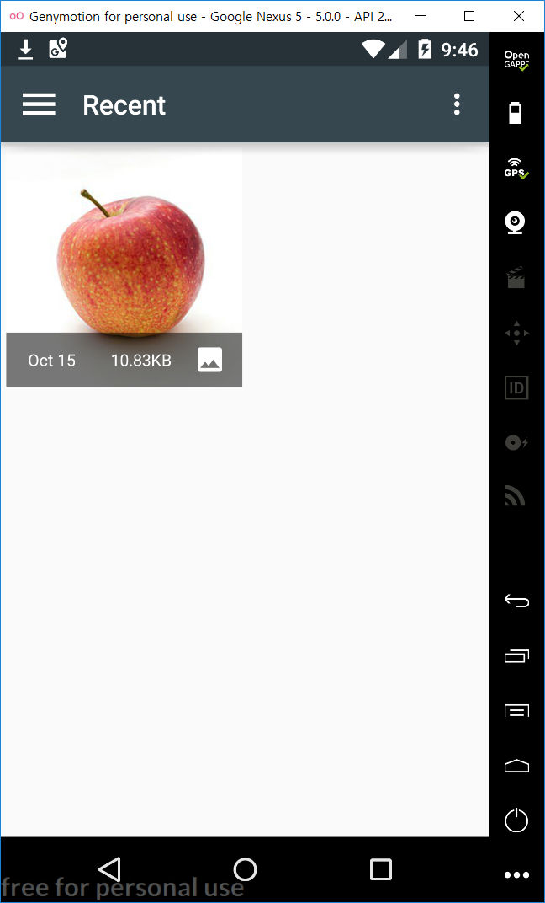

Chat Service for Gathering Data
==========================================================
We can give some recommendation to users with enneagram. 
User can make friends easy with this app. 
We can get some data from user. This data will be used for data analyzing.

For User win
------------
Good Service for young people. 

For Our win
------------
Good Serveying from user. 
You shouldn't let them know that they are getting surveyed.

Developement Steps.
--------------
<h1>1. Select The dev platform [done]</h1>
<h2>Platform : NodeJS</h2>
<h2>Framework : Angular6</h2>
<h2>Framework : Nativescript4</h2>
<h2>Database : Firebase</h2>
<h2><a href="https://github.com/sansoohan/Enneagram/blob/master/ChatService/NSPlayground/package.json">NodeJS Module Dependencies</a></h2>
<h2><a href="https://github.com/sansoohan/Enneagram/blob/master/ChatService/NSPlayground/app/App_Resources/Android/app.gradle">Android Dependencies</a></h2>

<h1>2. Make a login app with database [done]</h1>

<h1>3. Design simple function and make a simple UI [done]</h1>

Home UI

<h1>4. Design complex function and make a complex UI</h1>
<h2>Unlock Friend ChatUI</h2>

<h2>Friend Filtering with GPS and Enneagram</h2>

<h2>Friend Matching Service UI</h2>

<h2>Idea Matching Service UI</h2>

<h2>User Profile</h2>

<h2>Blog Editor UI</h2>

<h1>5. Link and test simple-data function to database.[done]</h1>
<h1>6. Link and test multi-interation function to database.[done]</h1>
<a href="https://github.com/sansoohan/Enneagram/blob/master/ChatService/NSPlayground/app/services/firebase.service.ts">Enneagram\ChatService\NSPlayground\app\services\firebase.service.ts</a>

<h1>7. Design OOP model and database.</h1>

Database Architect

 

User Database

 

User Storage

 

Chat Database

 

Blog Database

 

<h1>8. Build an IOS/android App.</h1>
<h1>9. Alpha test and bug report.</h1>
<h1>10. Redesign with fancy UI.</h1>
<h1>11. Refactoring.</h1>
<h1>12. Beta test and bug report.</h1>

myApp(Back-End Development)
-----
This is fo testing database. I have tested firebase database with this.

NSPlayground(Front-End Development)
------------
This is for UI test in the application. 
If you want to make some UI for mobile application, it will be good choice using NSPlayground.

Contact
--------
name : SanSoo Han 
email : sansoo2002@naver.com 
phone : +82 10-8835-9229
