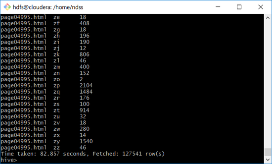
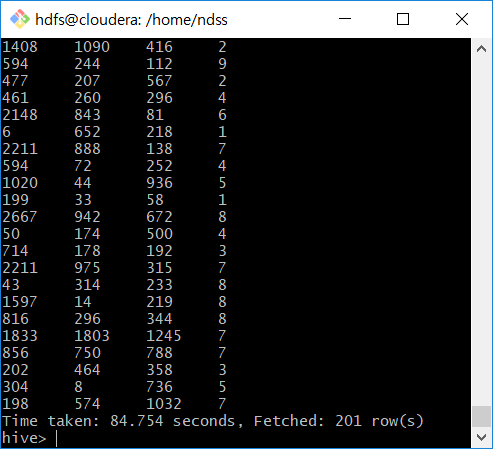

Enneagram - BigData Project for Analyzing Natural Language
==========================================================

result
------
1. Crawl and scrap the web page and save it on hive database.

2. MapReduce all the page for refinining.

3. Refine data for maching learning.

4. Make a classification model using tensorflow.

webCrawling
----------
This is not only crawl but also scrap. 
It also has library for hive jdbc for saving web page. 
TestQ.java : Test Simple hive query. 
Query.java : It stack the page until the number of column user set. 
BasicCrawler.java : Make hive jdbc Connection and Table if not exists. And it config before query. 
HiveQuery.java : Run query here. 
DataRefining.java : Data Refining with mapReduceQuery.txt after the Crawling.

wordGenerating
--------------
WordGenerator.java 
It generate words like Natural Language. 
Generated words and attributes are saved on words.txt. 
It also make a long query on mapReduceQuery.txt. This query is used after finishing WebCrawling.

pageGenerating
--------------
PageGenerator.java 
It generate page using words.txt. 
It also generate a-tags that linked into each pages on index.html for crawling.

training
--------
It train the model with the data 'refineData.txt' 
It reached at 99 percent accuracy so that you can predict the character of the page using this.

nextReserch
-----------
I made word_list that assumed natural language. 
So i will try to make a real word_list from now on.

Contact
----------
name : SanSoo Han 
email : sansoo2002@naver.com 
phone : +82 10-8835-9229