Recommend And Advertising with Enneagram
==========================================================

Goal
------------------------

This is web site for promotion for enneagram platform. 
User come and try random chat here. 
This system should be the bridge to the mobile application Friend Library.

Developement Steps.
------------------------
<h1>1. Select The dev platform [done]</h1>
<h2>Platform : NodeJS</h2>
<h2>Framework : Angular6</h2>
<h2>Framework : Bootstrap4</h2>
<h2>Database : Firebase</h2>
<h1>2. Application Home UI[done]</h1>
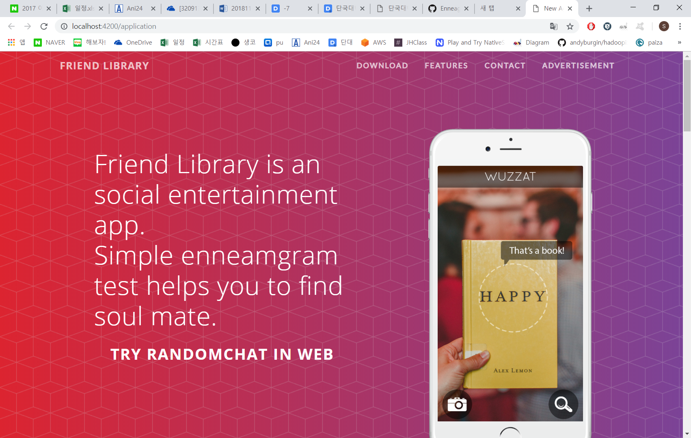 
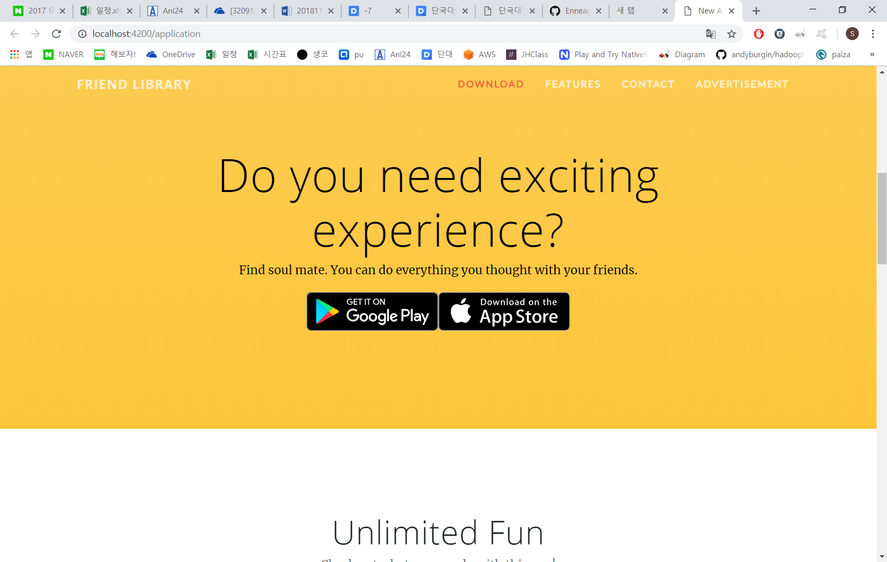 
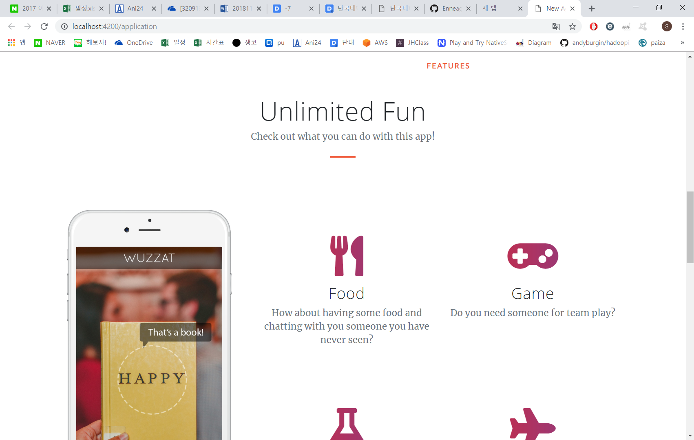 
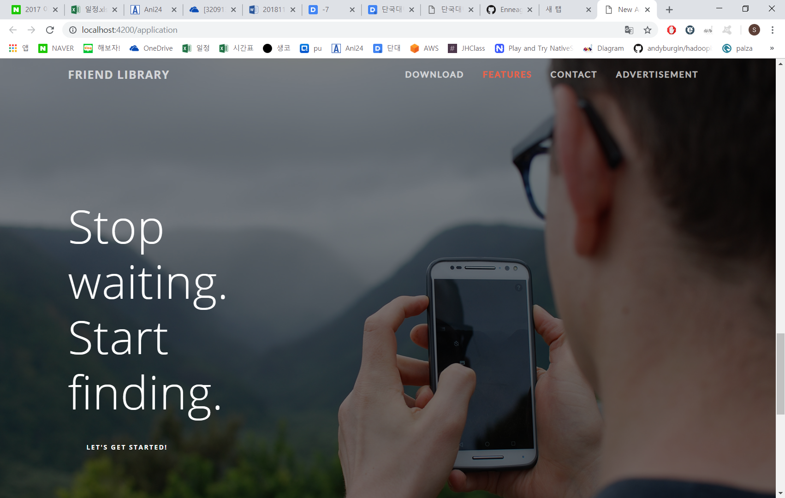 
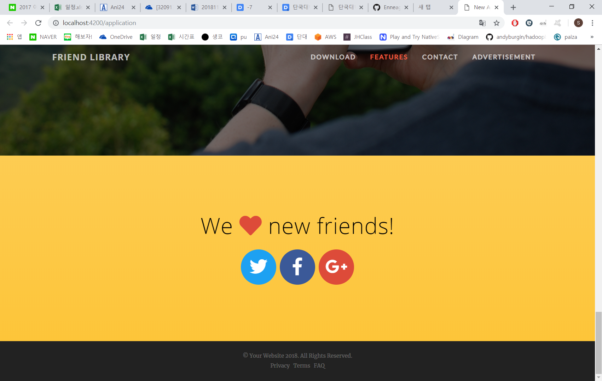 
<h1>3. Advertising Home UI[done]</h1>
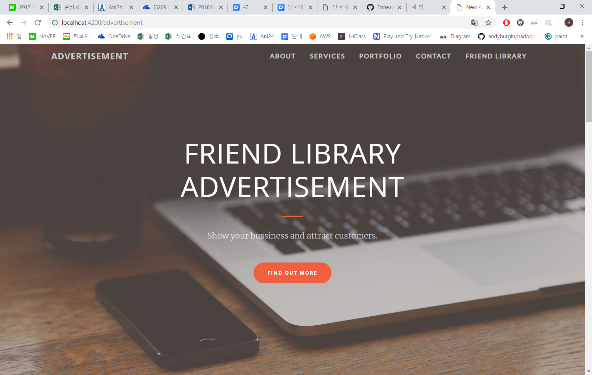 
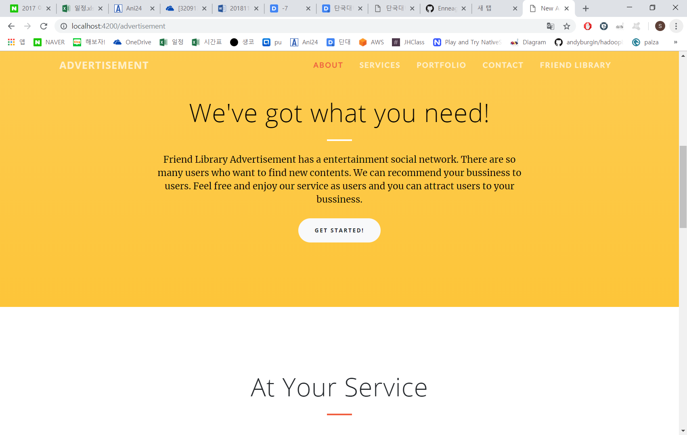 
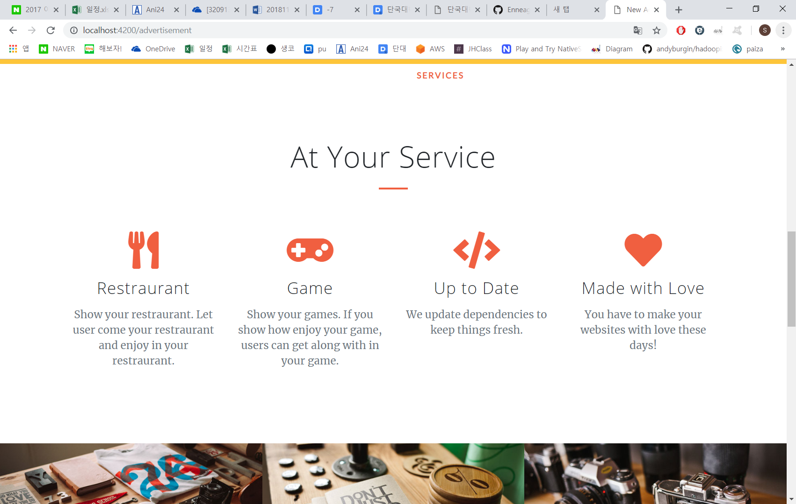 
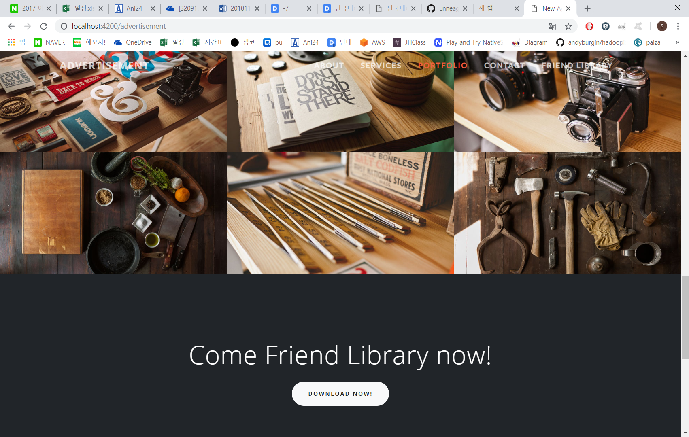 
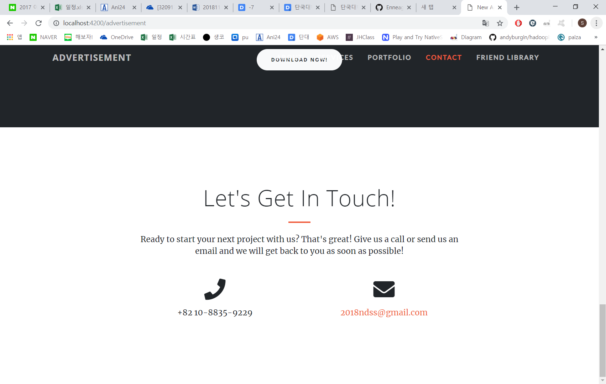 
<h1>4. Random Chat Room UI[done]</h1>
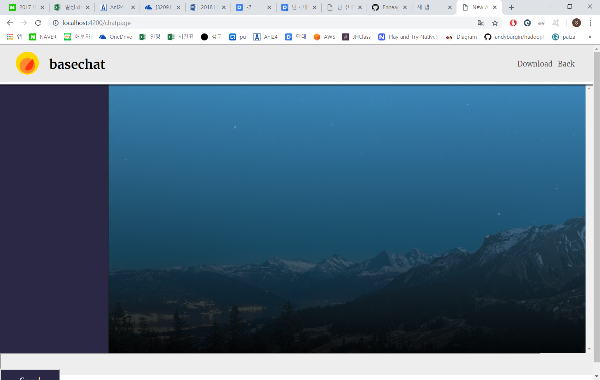 
<h1>5. Random Chat Function test</h1>
<h1>6. Random Chat Database Architect</h1>
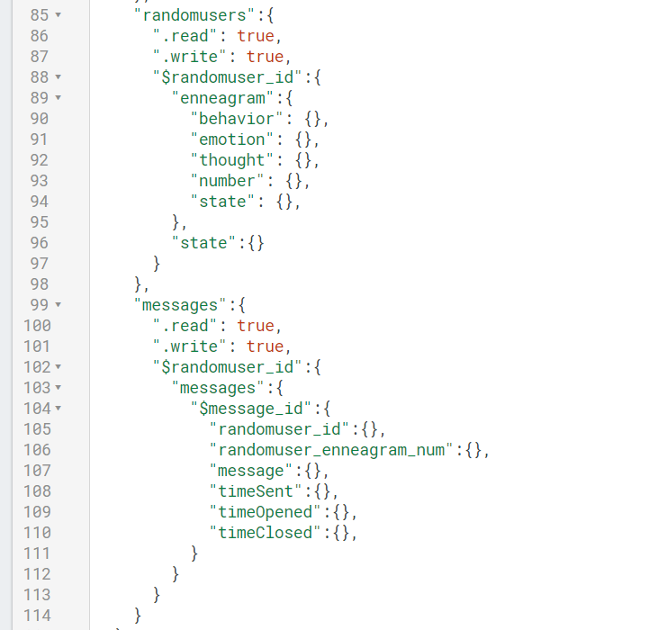 
<h1>7. Random Chat Multi-User Test</h1>
